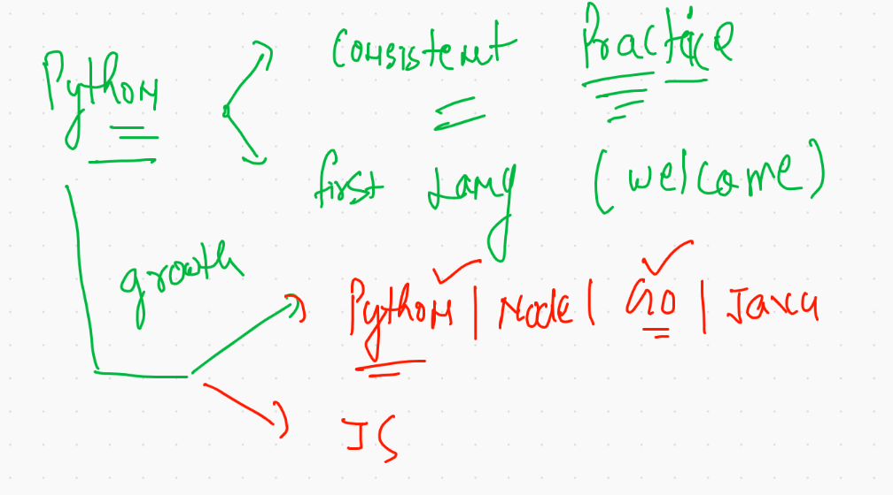
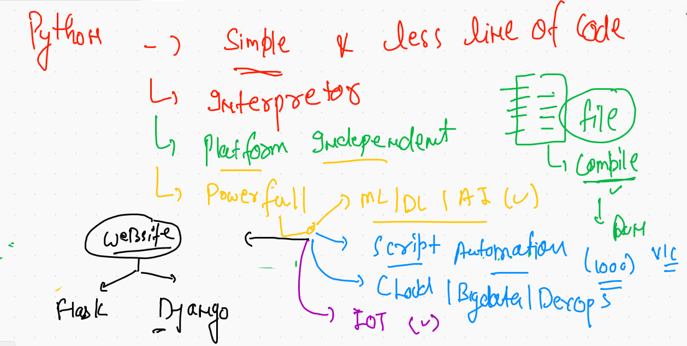
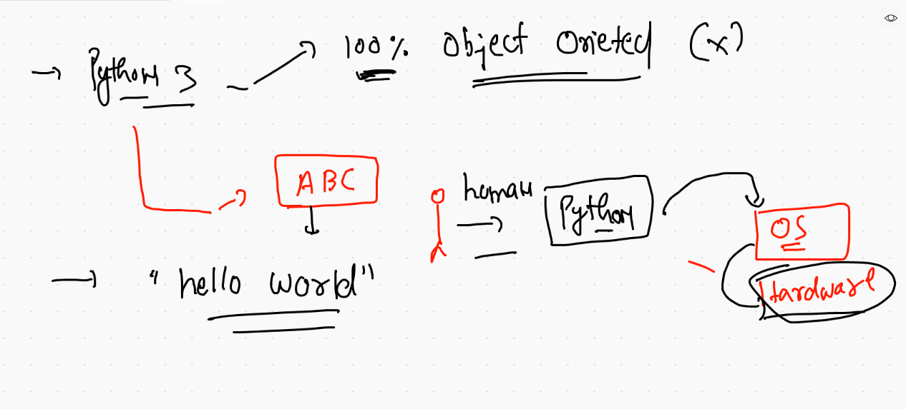
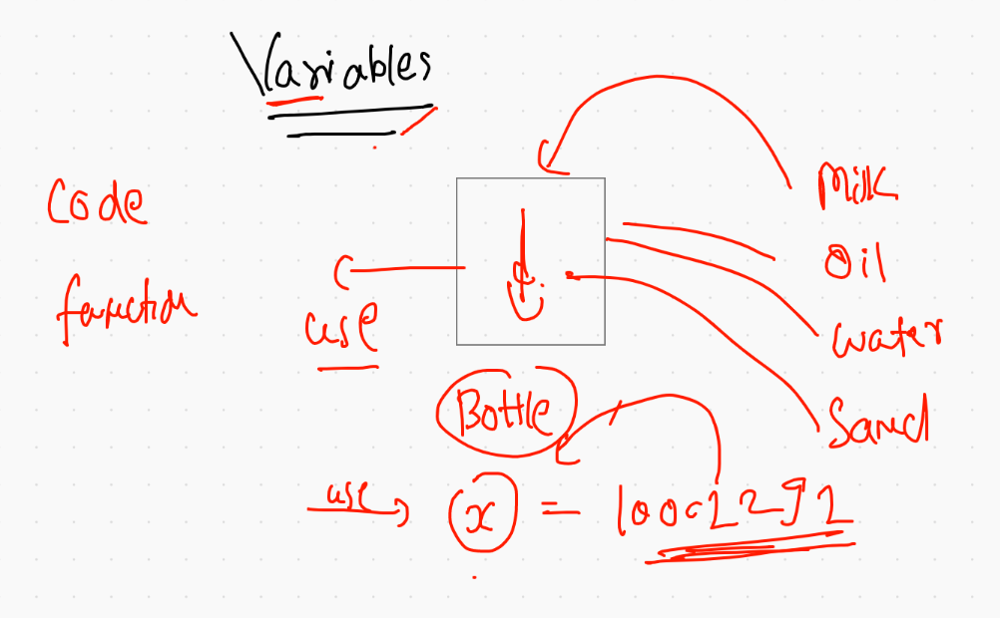
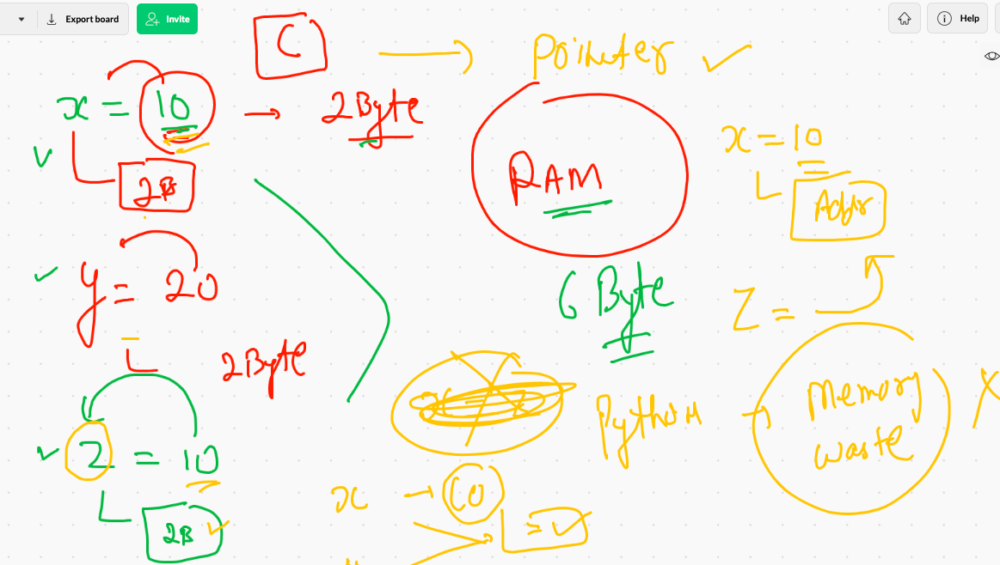

# Plz don't upload any thing in Main branch 

## ENjoy Core Learning 

# Welcome to PYthon LANG 

## LANG info 



### Intro to PYthon 



### PYthon as Human to OS lang



### Getting started with PYthon Interpretor 

```
anonymous@ashutoshhs-MacBook-Air ~ % python3
Python 3.9.4 (v3.9.4:1f2e3088f3, Apr  4 2021, 12:19:19) 
[Clang 12.0.0 (clang-1200.0.32.29)] on darwin
Type "help", "copyright", "credits" or "license" for more information.
>>> 
>>> 
>>> print(1000)
1000
>>> print(10.45)
10.45
>>> print('Hello LNB')
Hello LNB
>>> 
>>> print("Hello LNB")
Hello LNB
>>> 


```

## Introduction to Variables in Python 




### Demo of variables

```
anonymous@ashutoshhs-MacBook-Air ~ % python3
Python 3.9.4 (v3.9.4:1f2e3088f3, Apr  4 2021, 12:19:19) 
[Clang 12.0.0 (clang-1200.0.32.29)] on darwin
Type "help", "copyright", "credits" or "license" for more information.
>>> 
>>> 789999+20
790019
>>> 
>>> 4576+789999
794575
>>> 
>>> x=789999
>>> 
>>> 4454+x
794453
>>> 
>>> y=34.7
>>> 
>>> 567+y
601.7
>>> z="Hello world"
>>> 

```

### printing value of variables 

```
>>> print(x)
789999
>>> print(y)
34.7
>>> 
>>> print(z)
Hello world
>>> 
>>> print(x,y)
789999 34.7
>>> print(x,y,z)
789999 34.7 Hello world
>>> 


```
### TYpe checking of data 

```
>>> x=10
>>> 
>>> type(x)
<class 'int'>
>>> 
>>> x="10"
>>> 
>>> type(x)
<class 'str'>
>>> 


```

### Python as memory optimize language 

```
anonymous@ashutoshhs-MacBook-Air ~ % python3
Python 3.9.4 (v3.9.4:1f2e3088f3, Apr  4 2021, 12:19:19) 
[Clang 12.0.0 (clang-1200.0.32.29)] on darwin
Type "help", "copyright", "credits" or "license" for more information.
>>> x=10
>>> y=20
>>> id(x)
4419258960
>>> 
>>> id(y)
4419259280
>>> 
>>> z=10
>>> 
>>> id(z)
4419258960

```

### memory optimization 




