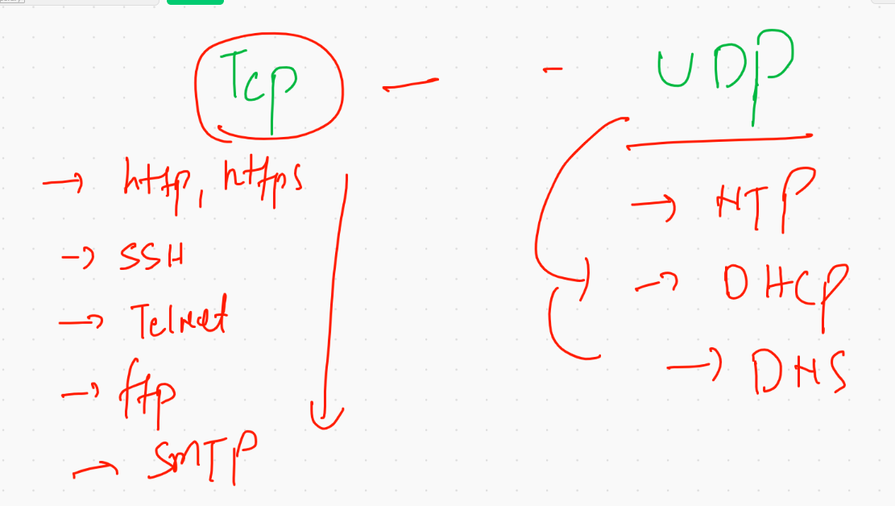
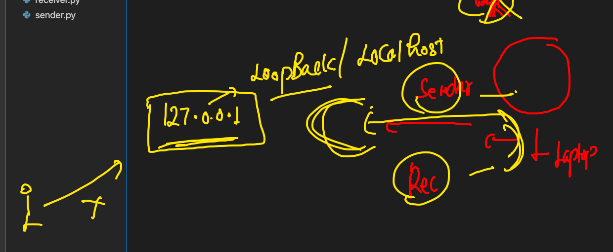

# Plz don't upload any thing in Main branch 

## ENjoy Core Learning 

## tcp vs UDP 


### Tcp and UDP examples 




### intro to loopback / localhost address



### importing socket library 

```
anonymous@ashutoshhs-MacBook-Air ~ % python3
Python 3.9.4 (v3.9.4:1f2e3088f3, Apr  4 2021, 12:19:19) 
[Clang 12.0.0 (clang-1200.0.32.29)] on darwin
Type "help", "copyright", "credits" or "license" for more information.
>>> 
>>> import socket
>>> dir(socket)
['AF_APPLETALK', 'AF_DECnet', 'AF_INET', 'AF_INET6', 'AF_IPX', 'AF_LINK', 'AF_ROUTE', 'AF_SNA', 'AF_SYSTEM', 'AF_UNIX', 'AF_UNSPEC', 'AI_ADDRCONFIG', 'AI_ALL', 'AI_CANONNAME', 'AI_DEFAULT', 'AI_MASK', 'AI_NUMERICHOST', 'AI_NUMERICSERV', 'AI_PASSIVE', 'AI_V4MAPPED', 'AI_V4MAPPED_CFG', 'AddressFamily', 'AddressInfo', 'CAPI', 'CMSG_LEN', 'CMSG_SPACE', 'EAGAIN', 'EAI_ADDRFAMILY', 'EAI_AGAIN', 'EAI_BADFLAGS', 'EAI_BADHINTS', 'EAI_FAIL', 'EAI_FAMILY', 'EAI_MAX', 'EAI_MEMORY', 'EAI_NODATA', 'EAI_NONAME', 'EAI_OVERFLOW', 'EAI_PROTOCOL', 'EAI_SERVICE', 'EAI_SOCKTYPE', '

```

