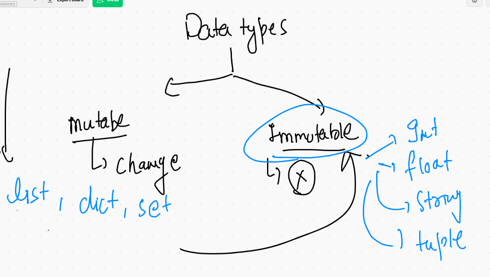
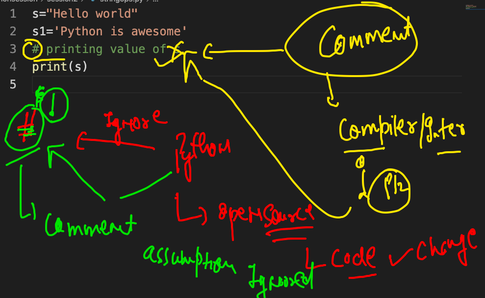
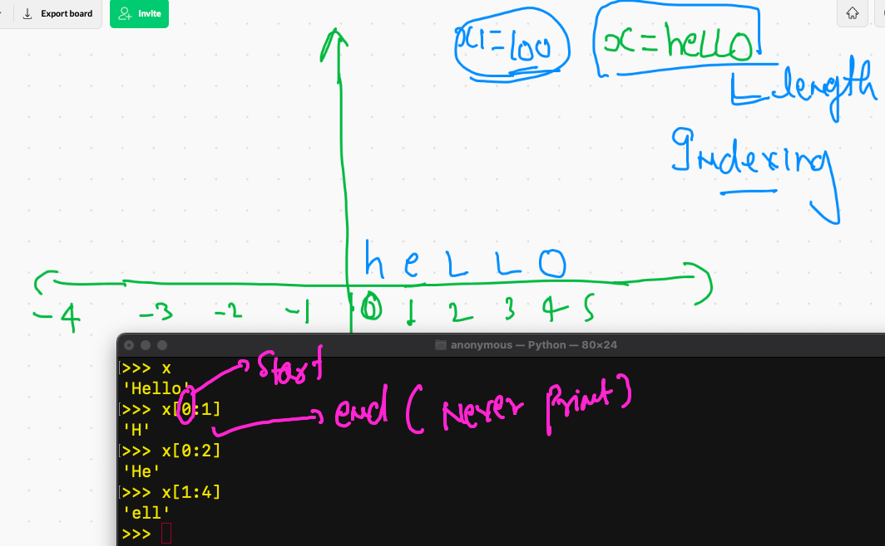
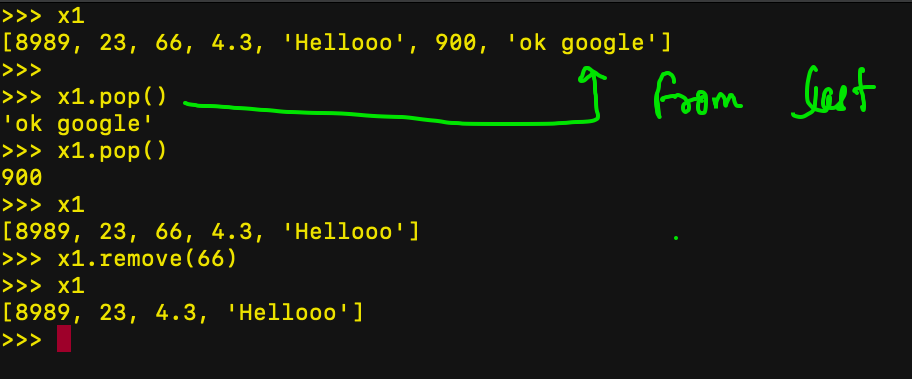

# Plz don't upload any thing in Main branch 

## ENjoy Core Learning 

## Data type in python 




## Task 2 IN python to remove comment identifier 



## Indexing and range printing in string 



### print last char of string 

```
anonymous@ashutoshhs-MacBook-Air ~ % python3
Python 3.9.4 (v3.9.4:1f2e3088f3, Apr  4 2021, 12:19:19) 
[Clang 12.0.0 (clang-1200.0.32.29)] on darwin
Type "help", "copyright", "credits" or "license" for more information.
>>> 
>>> x1="hsdlkfjsdlkfsdf sdfkj hhelllzz"
>>> x1[-1]
'z'


```

### More functions about string 

```
>>> help(str)

>>> x='hello'
>>> x.count('l')
2
>>> dir(x)
['__add__', '__class__', '__contains__', '__delattr__', '__dir__', '__doc__', '__eq__', '__format__', '__ge__', '__getattribute__', '__getitem__', '__getnewargs__', '__gt__', '__hash__', '__init__', '__init_subclass__', '__iter__', '__le__', '__len__', '__lt__', '__mod__', '__mul__', '__ne__', '__new__', '__reduce__', '__reduce_ex__', '__repr__', '__rmod__', '__rmul__', '__setattr__', '__sizeof__', '__str__', '__subclasshook__', 'capitalize', 'casefold', 'center', 'count', 'encode', 'endswith', 'expandtabs', 'find', 'format', 'format_map', 'index', 'isalnum', 'isalpha', 'isascii', 'isdecimal', 'isdigit', 'isidentifier', 'islower', 'isnumeric', 'isprintable', 'isspace', 'istitle', 'isupper', 'join', 'ljust', 'lower', 'lstrip', 'maketrans', 'partition', 'removeprefix', 'removesuffix', 'replace', 'rfind', 'rindex', 'rjust', 'rpartition', 'rsplit', 'rstrip', 'split', 'splitlines', 'startswith', 'strip', 'swapcase', 'title', 'translate', 'upper', 'zfill']
>>> 
>>> x.split()
['hello']
>>> x.split('l')
['he', '', 'o']


```

### checking type of data again 

```
anonymous@ashutoshhs-MacBook-Air ~ % python3
Python 3.9.4 (v3.9.4:1f2e3088f3, Apr  4 2021, 12:19:19) 
[Clang 12.0.0 (clang-1200.0.32.29)] on darwin
Type "help", "copyright", "credits" or "license" for more information.
>>> 
>>> x=(4,6,7)
>>> y=23,8
>>> z=(10)
>>> 
>>> print(type(x),type(y),type(z))
<class 'tuple'> <class 'tuple'> <class 'int'>
>>> 
>>> z1=(10,)
>>> type(z1)
<class 'tuple'>
>>> z1=20

```

## LIst 

### Demo1 

```
anonymous@ashutoshhs-MacBook-Air ~ % python3
Python 3.9.4 (v3.9.4:1f2e3088f3, Apr  4 2021, 12:19:19) 
[Clang 12.0.0 (clang-1200.0.32.29)] on darwin
Type "help", "copyright", "credits" or "license" for more information.
>>> 
>>> x1=[23,66,4.3,"Hellooo"]
>>> type(x1)
<class 'list'>
>>> 
>>> x1[0]
23
>>> x1[-1]
'Hellooo'
>>> x1[1:]
[66, 4.3, 'Hellooo']
>>> 
>>> 23 in x1
True
>>> 2333 in x1
False


```

### Demo2 

```
>>> x1
[23, 66, 4.3, 'Hellooo']
>>> x2=[23,66,4.3,"Hellooo",899,"FIne"]
>>> 
>>> x1+x2
[23, 66, 4.3, 'Hellooo', 23, 66, 4.3, 'Hellooo', 899, 'FIne']
>>> x3=x1+x2
>>> x3
[23, 66, 4.3, 'Hellooo', 23, 66, 4.3, 'Hellooo', 899, 'FIne']
>>> 
>>> x1
[23, 66, 4.3, 'Hellooo']
>>> len(x1)
4
>>> x1.append(900)
>>> x1
[23, 66, 4.3, 'Hellooo', 900]
>>> x1.append('ok google')
>>> x1
[23, 66, 4.3, 'Hellooo', 900, 'ok google']
>>> x1.insert(0,8989)
>>> x1
[8989, 23, 66, 4.3, 'Hellooo', 900, 'ok google']
>>> 

```

### demo 3



