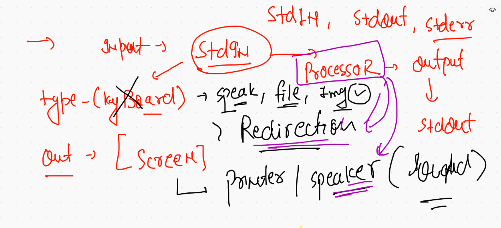
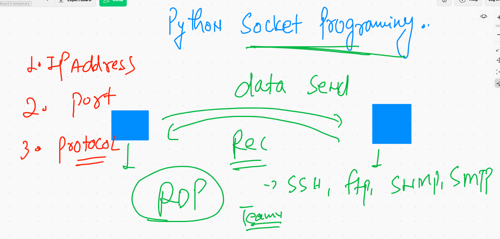
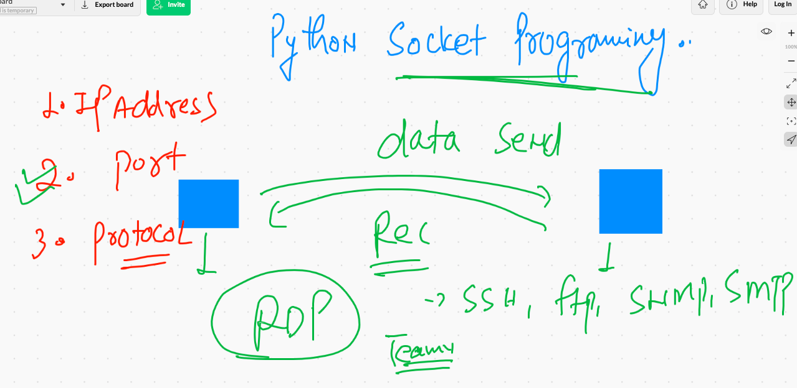
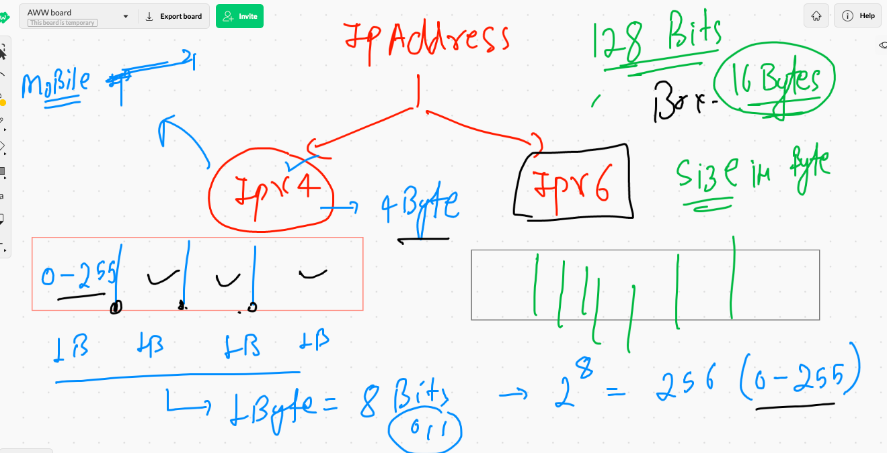
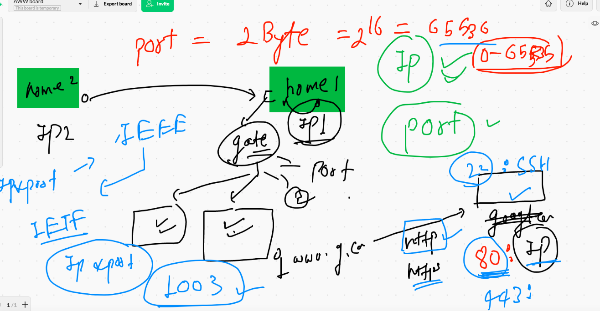

# Plz don't upload any thing in Main branch 

## ENjoy Core Learning 

## Redirection of STDIN and STDOUT in python 



## pyttsx3 --

### step 1

```
>>> import pyttsx3
>>> dir(pyttsx3)
['Engine', '__builtins__', '__cached__', '__doc__', '__file__', '__loader__', '__name__', '__package__', '__path__', '__spec__', '_activeEngines', 'driver', 'engine', 'init', 'speak', 'weakref']
>>> 
>>> myaudio=pyttsx3.init()
>>> 
>>> dir(myaudio)
['__class__', '__delattr__', '__dict__', '__dir__', '__doc__', '__eq__', '__format__', '__ge__', '__getattribute__', '__gt__', '__hash__', '__init__', '__init_subclass__', '__le__', '__lt__', '__module__', '__ne__', '__new__', '__reduce__', '__reduce_ex__', '__repr__', '__setattr__', '__sizeof__', '__str__', '__subclasshook__', '__weakref__', '_connects', '_debug', '_driverLoop', '_inLoop', '_notify', 'connect', 'disconnect', 'endLoop', 'getProperty', 'isBusy', 'iterate', 'proxy', 'runAndWait', 'save_to_file', 'say', 'setProperty', 'startLoop', 'stop']
>>> 

```

### setting voice rate --

```
>>> myaudio.say("Hey Jack")
>>> 
>>> myaudio.runAndWait()
>>> myaudio.getProperty('rate')
200.0
>>> myaudio.setProperty('rate',135)
>>> myaudio.say("Hey Jack")
>>> myaudio.runAndWait()
>>> myaudio.setProperty('rate',500)
>>> myaudio.say("Hey Jack")
>>> myaudio.setProperty('rate',500)
>>> myaudio.runAndWait()
>>> myaudio.runAndWait()
>>> myaudio.say("Hey Jack")
>>> myaudio.runAndWait()

```

### setting voice properties

```
myaudio.setProperty('voice',voices[0])
>>> 
>>> myaudio.setProperty('rate',200)
>>> 
>>> myaudio.say("Hey Jack")
>>> myaudio.runAndWait()
>>> myaudio.setProperty('voice',voices[0].id)
>>> myaudio.say("Hey Jack")
>>> myaudio.runAndWait()
>>> myaudio.setProperty('voice',voices[1].id)
>>> myaudio.say("Hey Jack")
>>> myaudio.runAndWait()
>>> myaudio.say("Hey Jack")
>>> myaudio.runAndWait()

```

## Welcome to python socket programming 



## Need 



### ip info 



### port info 




