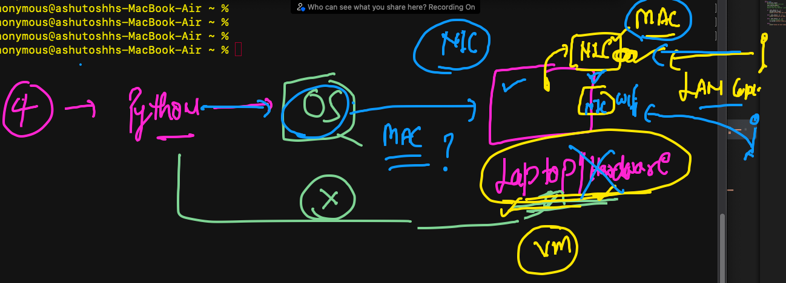
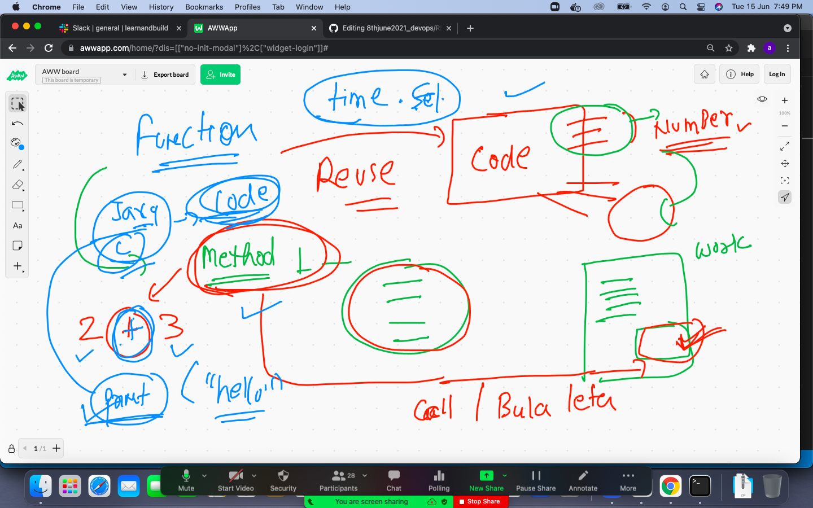
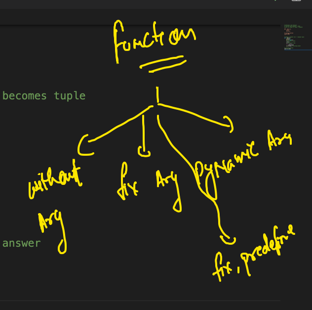

# MAC address in Hardware -- only NIC have that MAC address 



### Uderstanding function 



### TYpe of function in any programming lang 



## Best case calling and importing tricks for any Modules 

```
>>> 
>>> import  time
>>> del time 
>>> from  time  import ctime
>>> 
>>> ctime()
'Tue Jun 15 20:29:16 2021'
>>> 
>>> 
>>> import  time
>>> 
>>> time.ctime()
'Tue Jun 15 20:29:32 2021'
>>> 
>>> del time 
>>> from  time import sleep,ctime
>>> sleep(2)
>>> ctime()
'Tue Jun 15 20:29:55 2021'

```

