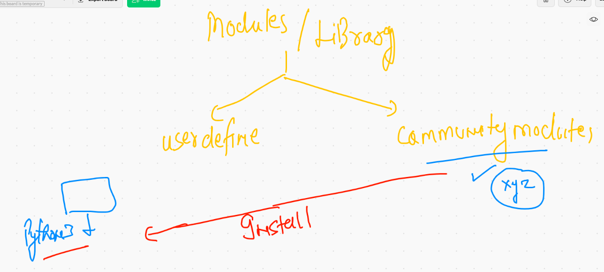

# Plz don't upload any thing in Main branch 

## ENjoy Core Learning 


## Introduction to modules 



## Correct way of loading any module python --

```
>>> import  time
>>> dir(time)
['CLOCK_MONOTONIC', 'CLOCK_MONOTONIC_RAW', 'CLOCK_PROCESS_CPUTIME_ID', 'CLOCK_REALTIME', 'CLOCK_THREAD_CPUTIME_ID', 'CLOCK_UPTIME_RAW', '_STRUCT_TM_ITEMS', '__doc__', '__loader__', '__name__', '__package__', '__spec__', 'altzone', 'asctime', 'clock_getres', 'clock_gettime', 'clock_gettime_ns', 'clock_settime', 'clock_settime_ns', 'ctime', 'daylight', 'get_clock_info', 'gmtime', 'localtime', 'mktime', 'monotonic', 'monotonic_ns', 'perf_counter', 'perf_counter_ns', 'process_time', 'process_time_ns', 'sleep', 'strftime', 'strptime', 'struct_time', 'thread_time', 'thread_time_ns', 'time', 'time_ns', 'timezone', 'tzname', 'tzset']
>>> 
>>> del time
>>> from  time  import  sleep,ctime
>>> sleep(3)
>>> ctime()
'Wed Jun 16 19:29:20 2021'
>>> 


```

### searching. functions inside a module with some matching keywords 

```
>>> 'sys' in  dir(os)
True
>>> for  i  in  dir(os):
...     if 'sys' in i:
...             print(i)
... 
sys
sysconf
sysconf_names
system
>>> 
>>> 
>>> [i for i in dir(os) if 'sys' in i]
['sys', 'sysconf', 'sysconf_names', 'system']
>>> 
>>> 


```

###  Using OS module 

```
>>> 
>>> import  os
>>> [i for  i  in dir(os) if  'dir' in i]
['chdir', 'curdir', 'fchdir', 'listdir', 'makedirs', 'mkdir', 'pardir', 'removedirs', 'rmdir', 'scandir', 'supports_dir_fd']
>>> os.mkdir("hello_Lnbbbbbbb")
>>> os.rmdir("hello_Lnbbbbbbb")
>>> os.listdir('.')
['pythonLnB', '.DS_Store', 'macdocker.pem', 'pythonsession', '.localized', 'mod.png', 'lnb']
>>> os.listdir('/')
['home', 'usr', 'bin', 'sbin', '.file', 'etc', 'var', 'Library', 'System', '.VolumeIcon.icns', 'private', '.vol', 'Users', 'Applications', 'opt', 'dev', 'Volumes', 'tmp', 'cores']
>>> os.listdir('C:\'

```

### demo 3 

```
anonymous@ashutoshhs-MacBook-Air ~ % python3
Python 3.9.4 (v3.9.4:1f2e3088f3, Apr  4 2021, 12:19:19) 
[Clang 12.0.0 (clang-1200.0.32.29)] on darwin
Type "help", "copyright", "credits" or "license" for more information.
>>> 
>>> import  os
>>> [i for  i  in dir(os) if  'dir' in i]
['chdir', 'curdir', 'fchdir', 'listdir', 'makedirs', 'mkdir', 'pardir', 'removedirs', 'rmdir', 'scandir', 'supports_dir_fd']
>>> 
>>> os.chdir('Desktop')
>>> os.mkdir('hiiiiiiyyyyy')
>>> os.rmdir('hiiiiiiyyyyy')
>>> 

```

### subprocess 

```
>>> import subprocess
>>> dir(subprocess)
['CalledProcessError', 'CompletedProcess', 'DEVNULL', 'PIPE', 'Popen', 'STDOUT', 'SubprocessError', 'TimeoutExpired', '_PIPE_BUF', '_PopenSelector', '_USE_POSIX_SPAWN', '__all__', '__builtins__', '__cached__', '__doc__', '__file__', '__loader__', '__name__', '__package__', '__spec__', '_active', '_args_from_interpreter_flags', '_cleanup', '_mswindows', '_optim_args_from_interpreter_flags', '_posixsubprocess', '_time', '_use_posix_spawn', 'builtins', 'call', 'check_call', 'check_output', 'contextlib', 'errno', 'getoutput', 'getstatusoutput', 'grp', 'io', 'list2cmdline', 'os', 'pwd', 'run', 'select', 'selectors', 'signal', 'sys', 'threading', 'time', 'types', 'warnings']
>>> 
>>> 
>>> subprocess.getoutput('uname')
'Darwin'
>>> subprocess.getoutput('date')
'Wed Jun 16 19:44:12 IST 2021'
>>> x=subprocess.getoutput('date')
>>> x
'Wed Jun 16 19:44:17 IST 2021'
>>> x=subprocess.getstatusoutput('date')
>>> x
(0, 'Wed Jun 16 19:44:30 IST 2021')
>>> x[0]
0
>>> x[1]
'Wed Jun 16 19:44:30 IST 2021'

```

### sys module 

```
>>> import  sys
>>> dir(sys)
['__breakpointhook__', '__displayhook__', '__doc__', '__excepthook__', '__interactivehook__', '__loader__', '__name__', '__package__', '__spec__', '__stderr__', '__stdin__', '__stdout__', '__unraisablehook__', '_base_executable', '_clear_type_cache', '_current_frames', '_debugmallocstats', '_framework', '_getframe', '_git', '_home', '_xoptions', 'abiflags', 'addaudithook', 'api_version', 'argv', 'audit', 'base_exec_prefix', 'base_prefix', 'breakpointhook', 'builtin_module_names', 'byteorder', 'call_tracing', 'copyright', 'displayhook', 'dont_write_bytecode', 'exc_info', 'excepthook', 'exec_prefix', 'executable', 'exit', 'flags', 'float_info', 'float_repr_style', 'get_asyncgen_hooks', 'get_coroutine_origin_tracking_depth', 'getallocatedblocks', 'getdefaultencoding', 'getdlopenflags', 'getfilesystemencodeerrors', 'getfilesystemencoding', 'getprofile', 'getrecursionlimit', 'getrefcount', 'getsizeof', 'getswitchinterval', 'gettrace', 'hash_info', 'hexversion', 'implementation', 'int_info', 'intern', 'is_finalizing', 'maxsize', 'maxunicode', 'meta_path', 'modules', 'path', 'path_hooks', 'path_importer_cache', 'platform', 'platlibdir', 'prefix', 'ps1', 'ps2', 'pycache_prefix', 'set_asyncgen_hooks', 'set_coroutine_origin_tracking_depth', 'setdlopenflags', 'setprofile', 'setrecursionlimit', 'setswitchinterval', 'settrace', 'stderr', 'stdin', 'stdout', 'thread_info', 'unraisablehook', 'version', 'version_info', 'warnoptions']
>>> [i for  i in dir(sys) if  'plat' in i]
['platform', 'platlibdir']
>>> sys.platform 
'darwin'
>>> [i for  i in dir(sys) if  'ar' in i]
['_clear_type_cache', 'argv', 'warnoptions']

```

## Installer in OS and Lang 


